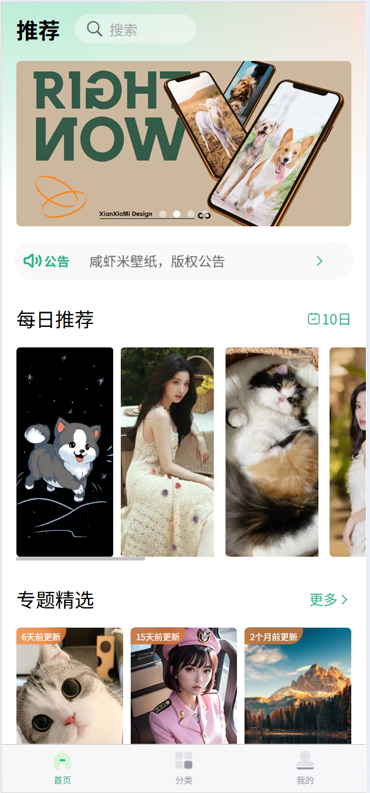
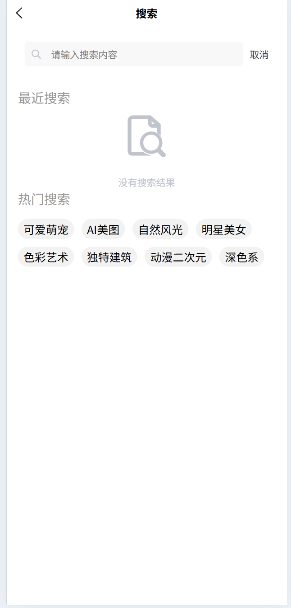
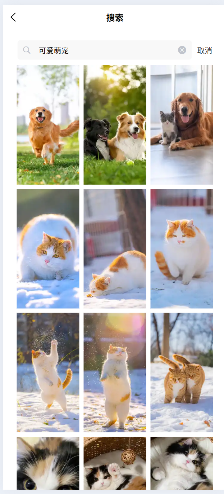
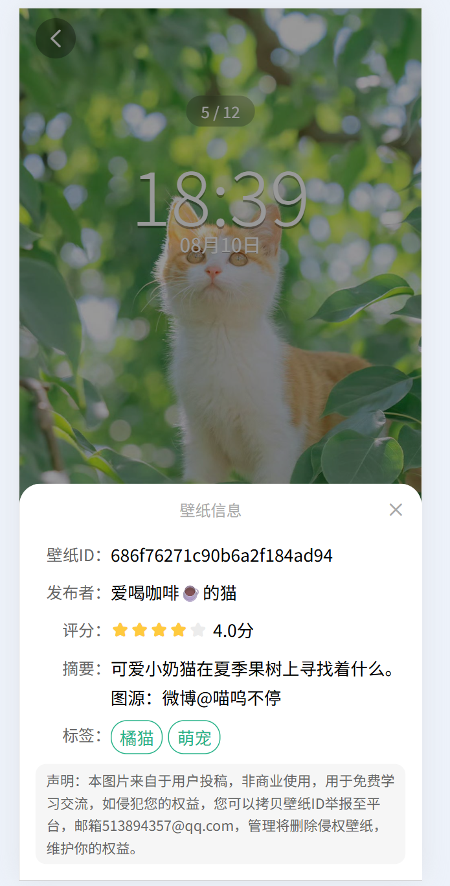
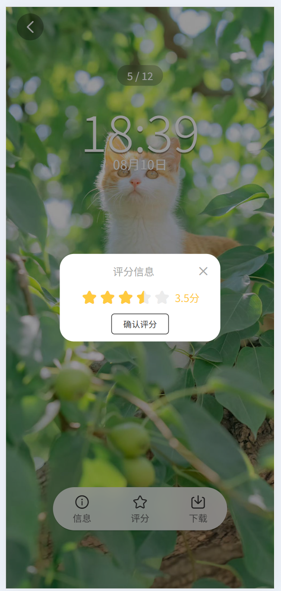
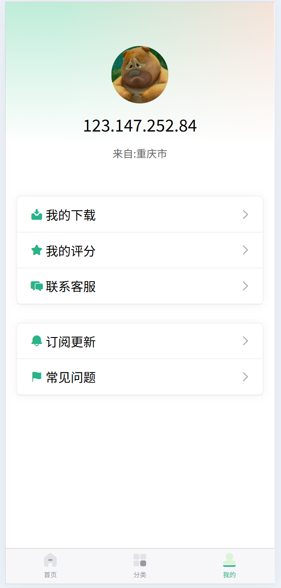

# 咸虾米壁纸 - 微信小程序项目

## 项目概述

这是一个基于 UniApp 开发的壁纸类微信小程序项目，跟随 B 站教程学习实现。项目名为"咸虾米壁纸"，主要功能包括壁纸分类展示、热门推荐、搜索下载等。

## 技术栈

- **开发框架**: UniApp (Vue.js 语法)
- **UI 组件**: UniUI + 自定义组件
- **本地缓存**: uni.setStorage/uni.getStorage
- **开发工具**: HBuilderX

## 项目特点

- 使用 UniApp 实现一套代码多端运行
- 微信小程序原生体验优化
- 瀑布流式壁纸展示
- 分类标签系统
- 图片懒加载与缓存策略
- 适配不同尺寸屏幕

## 功能模块

### 已完成功能

- 首页热门壁纸推荐
- 壁纸分类浏览
- 壁纸搜索功能
- 壁纸详情与下载

## 项目结构

```
xianxiami-wallpaper/
├── common/                     # 公共资源
│   ├── style/                    # 公共样式
│   ├── images/                   # 公共图片
├── components/                 # 自定义组件
├── pages/                      # 页面组件
│   ├── index/                  # 首页
│   ├── classify/               # 分类页
│   ├── search/                 # 搜索页
│   ├── preview/                 # 详情页
│   └── user/                     # 个人中心
├── static/                     # 静态资源
├── App.vue                     # 应用配置
├── main.js                     # 入口文件
├── manifest.json               # 应用配置
└── pages.json                  # 页面路由配置
```

## 安装与运行

### 开发环境准备

1. 安装 HBuilderX 开发工具
2. 申请微信小程序 AppID

### 项目运行

1. 使用 HBuilderX 导入项目
2. 配置微信小程序 AppID (manifest.json)
3. 运行 -> 运行到小程序模拟器 -> 微信开发者工具

### 自定义配置

修改 `common/config.js` 中的 API 基础地址和其他配置项

## 学习资源

- [B 站教程链接]([uniappVue3版本+咸虾米壁纸: uniappVue3版本基础demo及咸虾米壁纸项目的开源代码](https://gitee.com/qingnian8/univue3#https://gitee.com/link?target=https%3A%2F%2Fapi.thecatapi.com%2Fv1%2Fimages%2Fsearch%3Flimit%3D1))

## 截图预览

#### 首页




#### 搜索页




#### 分类




#### 详情页







#### 我的


